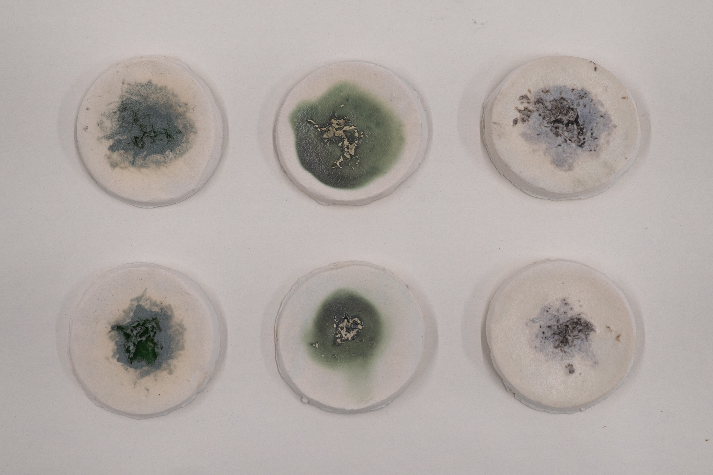

<!-- One of the questions this week asks you to fill in a table; that table is copied here from the course page's markdown
     (https://edit.htgaa.org/2026a-course-pages/webpages.git/src/branch/main/content/weeks/week-01/_index.md?display=source)
     just as a convenience -- you DON'T have to use this to complete your homework!  Any form, format or content which is
     responsive to the question is acceptable (the more creative the better!).

     If you want to use this form, you can fill in the table by putting your scoring for each action between the |  | markers
     for each column; DO NOT enter any newlines between the |  | markers, that starts a new table row right there!
 -->
 ## Week 1 HW Part 1
 1. First, describe a biological engineering application or tool you want to develop and why

 2. Next, describe one or more governance/policy goals related to ensuring that this application or tool contributes to an “ethical” future, like ensuring non-malfeasance (preventing harm). Break big goals down into two or more specific sub-goals.

 3. Next, describe at least three different potential governance “actions” by considering the four aspects below (Purpose, Design, Assumptions, Risks of Failure & “Success”).

 4. Next, score (from 1-3 with, 1 as the best, or n/a) each of your governance actions against your rubric of policy goals. The following is one framework but feel free to make your own:

| Does the option:                                    | Option 1 | Option 2 | Option 3 |
|-----------------------------------------------------|----------|----------|----------|
| **Enhance Biosecurity**                             |          |          |          |
| &bull; By preventing incidents                      |          |          |          |
| &bull; By helping respond                           |          |          |          |
| **Foster Lab Safety**                               |          |          |          |
| &bull; By preventing incident                       |          |          |          |
| &bull; By helping respond                           |          |          |          |
| **Protect the environment**                         |          |          |          |
| &bull; By preventing incidents                      |          |          |          |
| &bull; By helping respond                           |          |          |          |
| **Other considerations**                            |          |          |          |
| &bull; Minimizing costs and burdens to stakeholders |          |          |          |
| &bull; Feasibility?                                 |          |          |          |
| &bull; Not impede research                          |          |          |          |
| &bull; Promote constructive applications            |          |          |          |

5. Last, drawing upon this scoring, describe which governance option, or combination of options, you would prioritize, and why. Outline any trade-offs you considered as well as assumptions and uncertainties.

---