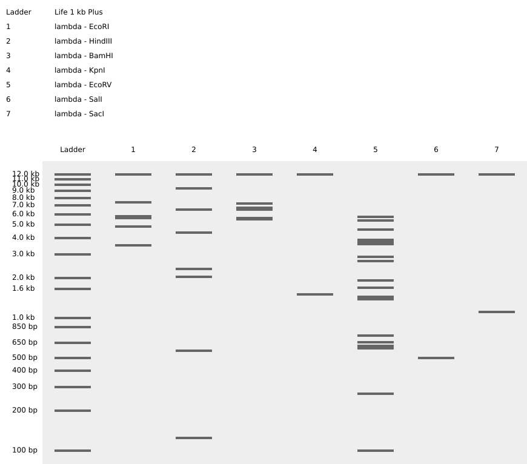

## Part 1: Benchling & In-silico Gel Art 
 
## Part 2: Gel Art - Restriction Digests and Gel Electrophoresis
| pre                           | post                            |
| ----------------------------------- | ----------------------------------- |
|||

## Part 3: DNA Design Challenge

3.1. Choose your protein.

**I chose the protein <mark>Copper Transporter 1 (COPT1)</mark> from Arabidopsis thaliana (UniProt ID: COPT1_ARATH). This protein functions as a membrane transporter responsible for copper uptake in plants. Copper is an essential micronutrient required for many cellular processes, including photosynthesis and enzyme activity, but it can also become toxic at high concentrations. Because of this, organisms require specialized transport proteins such as COPT1 to regulate copper uptake and maintain homeostasis.**

**I am interested in this protein because it is related to a research project I am developing involving the aquatic plant Lemna minor (duckweed). In this project, I am exploring whether introducing or increasing the expression of the copper uptake gene COPT1 could potentially enhance copper uptake in Lemna minor compared to the wild type. This could have implications for phytoremediation, where plants are used to remove heavy metals from contaminated water.**

**To obtain the protein sequence, I searched for COPT1_ARATH on the UniProt database. The amino acid sequence for the COPT1 protein was copied directly from the UniProt entry and is provided below.**

<code class="copy-to-clipboard-code highlight" data-code="&gt;sp|Q39065|COPT1_ARATH Copper transporter 1 OS=Arabidopsis thaliana OX=3702 GN=COPT1 PE=2 SV=2
MDHDHMHGMPRPSSSSSSSPSSMMNNGSMNEGGGHHHMKMMMHMTFFWGKNTEVLFSGWP
GTSSGMYALCLIFVFFLAVLTEWLAHSSLLRGSTGDSANRAAGLIQTAVYTLRIGLAYLV
MLAVMSFNAGVFLVALAGHAVGFMLFGSQTFRNTSDDRKTNYVPPSGCAC">&gt;sp|Q39065|COPT1_ARATH Copper transporter 1 OS=Arabidopsis thaliana OX=3702 GN=COPT1 PE=2 SV=2
MDHDHMHGMPRPSSSSSSSPSSMMNNGSMNEGGGHHHMKMMMHMTFFWGKNTEVLFSGWP
GTSSGMYALCLIFVFFLAVLTEWLAHSSLLRGSTGDSANRAAGLIQTAVYTLRIGLAYLV
MLAVMSFNAGVFLVALAGHAVGFMLFGSQTFRNTSDDRKTNYVPPSGCAC</code><button type="button" title="Copy text to clipboard"><i class="fa-fw far fa-copy"></i></button>

3.2. Reverse Translate: Protein (amino acid) sequence to DNA (nucleotide) sequence.

>
COPT1-ARATH Protein Reverse-translated DNA sequence <code class="copy-to-clipboard-code highlight" data-code="atggatcatgaccatatgcacatgggtatgccgcggccgtcttcttcttcttcttcttcttctccgtcttctatgatgaacaacggttctatgaacgaaggtggtggtcaccaccacatgaaaatgatgatgcacatgacctttttctggggtaaaaacacggaagtgctgttctctggctggccaggcacctcttctggtatgtacgccctgtgtctcatcttcgtcttcttcttggccgtgctgacggaatggctggcgcactcttctctgctgcggggttctactggtgactctgcgaaccgtgcggctgggcttatccaaactgcggtgtacactctgcgtattggcctggcctacgtgctgatggttctggcggtgatgagctttaacgccggtgtgtttctggtggccctggccggtcatgcggtgggtttcatgctgttcggctcccaaaccttccgtaacacctctgatgatcggaagacgaactacgtgccgccatctggttgtgcctgt">atggatcatgaccatatgcacatgggtatgccgcggccgtcttcttcttcttcttcttcttctccgtcttctatgatgaacaacggttctatgaacgaaggtggtggtcaccaccacatgaaaatgatgatgcacatgacctttttctggggtaaaaacacggaagtgctgttctctggctggccaggcacctcttctggtatgtacgccctgtgtctcatcttcgtcttcttcttggccgtgctgacggaatggctggcgcactcttctctgctgcggggttctactggtgactctgcgaaccgtgcggctgggcttatccaaactgcggtgtacactctgcgtattggcctggcctacgtgctgatggttctggcggtgatgagctttaacgccggtgtgtttctggtggccctggccggtcatgcggtgggtttcatgctgttcggctcccaaaccttccgtaacacctctgatgatcggaagacgaactacgtgccgccatctggttgtgcctgt</code><button type="button" title="Copy text to clipboard"><i class="fa-fw far fa-copy"></i></button>

**Because of the <mark>degeneracy of the genetic code</mark>, multiple DNA sequences can encode the same protein sequence. Therefore, the reverse-translated DNA sequence shown above represents only one possible nucleotide sequence that could encode the protein. For the next step, the sequence would often be codon-optimized for the host organism, Lemna minor, to improve gene expression.**

3.3. Codon optimization.

**Codon optimization is necessary because of the <mark>degeneracy of the genetic code</mark>. A single amino acid can be encoded by multiple different codons (DNA sequences). Even though these codons produce the same amino acid, different organisms tend to prefer certain codons over others due to differences in tRNA abundance and translation efficiency.**

**Therefore, once the desired protein sequence is known, the next step is to determine a DNA coding sequence that matches the codon usage preference of the host organism. Codon usage tables provide information about which codons are most frequently used in a particular organism. By selecting codons that are more commonly used in the host organism, the likelihood of efficient protein translation and higher expression levels can be improved.**

**For this project, the codon sequence was optimized for Lemna minor (duckweed). This organism was chosen because the goal of the project is to introduce and express the copper transporter protein COPT1 in Lemna minor in order to potentially enhance copper uptake compared to the wild type. Optimizing the codon usage for Lemna minor increases the chance that the plant’s cellular machinery will efficiently translate the gene and produce the desired protein.**

Lemna minor [gbpln]: 4 CDS's (1597 codons)  
fields: [triplet] [frequency: per thousand] ([number]) 
<pre>
UUU 17.5(    28)  UCU 13.8(    22)  UAU  8.8(    14)  UGU  5.0(     8)
UUC 36.3(    58)  UCC 17.5(    28)  UAC 15.7(    25)  UGC 14.4(    23)
UUA  5.6(     9)  UCA 14.4(    23)  UAA  0.0(     0)  UGA  1.9(     3)
UUG 13.8(    22)  UCG 13.8(    22)  UAG  0.6(     1)  UGG 16.3(    26)

CUU 15.7(    25)  CCU 11.9(    19)  CAU  6.9(    11)  CGU  4.4(     7)
CUC 25.7(    41)  CCC 15.7(    25)  CAC 16.9(    27)  CGC 18.2(    29)
CUA  5.0(     8)  CCA 11.3(    18)  CAA 10.0(    16)  CGA  6.3(    10)
CUG 21.3(    34)  CCG 14.4(    23)  CAG 22.5(    36)  CGG 10.6(    17)

AUU 18.8(    30)  ACU  9.4(    15)  AAU 13.8(    22)  AGU 10.0(    16)
AUC 19.4(    31)  ACC 17.5(    28)  AAC 21.9(    35)  AGC 15.0(    24)
AUA  1.9(     3)  ACA  5.0(     8)  AAA 15.7(    25)  AGA 20.7(    33)
AUG 20.7(    33)  ACG 10.0(    16)  AAG 35.7(    57)  AGG 17.5(    28)

GUU 15.0(    24)  GCU 25.0(    40)  GAU 20.0(    32)  GGU  8.1(    13)
GUC 25.0(    40)  GCC 22.5(    36)  GAC 26.3(    42)  GGC 21.9(    35)
GUA  6.3(    10)  GCA 14.4(    23)  GAA 26.3(    42)  GGA 16.9(    27)
GUG 30.7(    49)  GCG 18.2(    29)  GAG 40.1(    64)  GGG 18.2(    29)
</pre>
https://www.kazusa.or.jp/codon/cgi-bin/showcodon.cgi?species=4472

3.4. You have a sequence! Now what?

## Part 5 DNA Read/Write/Edit

5.1 DNA Read
(i) What DNA would you want to sequence (e.g., read) and why?
(ii) In lecture, a variety of sequencing technologies were mentioned. What technology or technologies would you use to perform sequencing on your DNA and why?
Also answer the following questions:
    Is your method first-, second- or third-generation or other? How so?
    What is your input? How do you prepare your input (e.g. fragmentation, adapter ligation, PCR)? List the essential steps.
    What are the essential steps of your chosen sequencing technology, how does it decode the bases of your DNA sample (base calling)?
    What is the output of your chosen sequencing technology?

5.2 DNA Write
(i) What DNA would you want to synthesize (e.g., write) and why?
(ii) What technology or technologies would you use to perform this DNA synthesis and why?
Also answer the following questions:
    What are the essential steps of your chosen sequencing methods?
    What are the limitations of your sequencing method (if any) in terms of speed, accuracy, scalability?

5.3 DNA Edit
(i) What DNA would you want to edit and why?
(ii) What technology or technologies would you use to perform these DNA edits and why?
Also answer the following questions:
    How does your technology of choice edit DNA? What are the essential steps?
    What preparation do you need to do (e.g. design steps) and what is the input (e.g. DNA template, enzymes, plasmids, primers, guides, cells) for the editing?
    What are the limitations of your editing methods (if any) in terms of efficiency or precision?