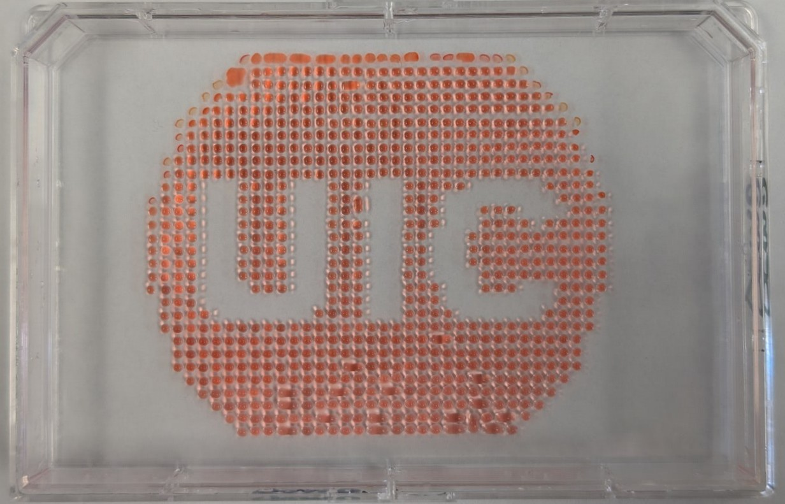

| GUI design                            | Opentron                            |
| ----------------------------------- | ----------------------------------- |
|||

Python Script for Opentrons Artwork
upload the code

Post-Lab Questions
1. Find and describe a published paper that utilizes the Opentrons or an automation tool to achieve novel biological applications.
2. Write a description about what you intend to do with automation tools for your final project. You may include example pseudocode, Python scripts, 3D printed holders, a plan for how to use Ginkgo Nebula, and more. You may reference this week’s recitation slide deck for lab automation details.