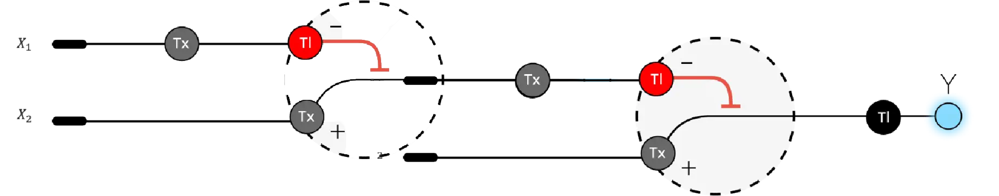

## Assignment Part 1: Intracellular Artificial Neural Networks (IANNs)
1. What advantages do IANNs have over traditional genetic circuits, whose input/output behaviors are Boolean functions?

**Intracellular Artificial Neural Network (IANNs) operate on analog signals because their core components—promoters, transcription factors, and regulatory elements—produce continuously variable expression levels rather than binary ON/OFF states. In these systems, transcription factor concentration acts as the input value, promoter strength functions as the weight, and the Hill‑function response provides the nonlinear activation curve, directly mirroring the structure of artificial neural networks. Instead of flipping between 0 and 1 like Boolean genetic circuits, each input gene generates a graded expression level that becomes the signal strength entering the network. This allows IANNs to process subtle differences in input concentration and integrate weighted contributions, where some signals influence the output more strongly than others. Because the regulatory responses are nonlinear, IANNs can implement thresholding, sigmoidal activation, and multi‑layer logic that far exceed the capabilities of simple AND/OR/NOT gates. They also scale more efficiently: adding new inputs doesn’t require exponentially more genetic parts, avoiding the combinatorial explosion typical of Boolean circuits. Finally, the analog nature of weighted integration makes IANNs more robust to biological noise, smoothing fluctuations that would destabilize traditional digital logic circuits.**

2. Describe a useful application for an IANN; include a detailed description of input/output behavior, as well as any limitations an IANN might face to achieve your goal.

**A useful application of an IANN is engineering Lemna minor to perform context‑dependent copper phytoremediation. In this design, the IANN integrates three graded biological inputs—extracellular Cu²⁺ concentration, intracellular oxidative stress (ROS), and the plant’s metabolic state—each contributing with different weights to a combined activation score. When copper levels are low, the weighted sum remains below threshold, allowing the plant to behave normally and minimizing unnecessary metal uptake. As Cu²⁺ increases, the IANN produces a proportional output by modulating expression of genes such as COPT1 (copper uptake), PCS (phytochelatin‑based detoxification), and an RFP reporter, enabling a smooth transition from minimal to strong remediation activity. This analog, nonlinear behavior allows the plant to activate remediation only when environmental copper is high, reducing metabolic burden and limiting ecological invasiveness. However, the system faces several challenges: biological noise can disrupt signal integration, tuning promoter strengths to achieve precise “weights” is difficult, regulatory parts are limited, and transcriptional delays may slow the plant’s response to rapidly changing conditions. Despite these constraints, an IANN provides a powerful framework for building a smart, environmentally responsive phytoremediation system.**

3. Below is a diagram depicting an intracellular single-layer perceptron where the X1 input is DNA encoding for the Csy4 endoribonuclease and the X2 input is DNA encoding for a fluorescent protein output whose mRNA is regulated by Csy4. Tx: transcription; Tl: translation. 
  Draw a diagram for an intracellular multilayer perceptron where layer 1 outputs an endoribonuclease that regulates a fluorescent protein output in layer 2.

 

## Assignment Part 2: Fungal Materials
1. What are some examples of existing fungal materials and what are they used for? What are their advantages and disadvantages over traditional counterparts?

**Mycelium‑based materials already appear in several commercial forms, including packaging foams, leather alternatives, and structural composites. Mycelium packaging replaces Styrofoam for protective shipping materials and offers advantages such as biodegradability, low‑energy production, and compostability, though it lacks the water resistance and mechanical strength of plastics. Mycelium leather products, used in clothing and upholstery, provide an animal‑free and lower‑carbon alternative to traditional leather but still fall short in durability. More structurally oriented mycelium materials—such as bricks, insulation panels, and molded foams—are used for building, furniture, and consumer goods. These materials are lightweight, fire‑resistant, and easily shaped, but they generally require controlled growth conditions and have lower strength and moisture resistance than conventional construction materials.**

2. What might you want to genetically engineer fungi to do and why? What are the advantages of doing synthetic biology in fungi as opposed to bacteria?

**Fungi could be engineered to produce stronger, more water‑resistant mycelium materials, degrade pollutants like plastics or heavy metals, secrete valuable enzymes, or grow functional materials such as conductive composites. Engineering fungi is attractive because their natural mycelial networks already form robust 3D structures, making them ideal living scaffolds for materials. They also possess eukaryotic machinery, allowing them to fold and secrete complex proteins that bacteria cannot handle. Fungi grow on cheap agricultural waste, tolerate harsh environmental conditions, and generate diverse metabolites, giving them far greater versatility than bacterial systems. Overall, synthetic biology in fungi enables the creation of advanced, sustainable materials and bioprocesses that would be difficult or impossible to achieve in bacteria.**