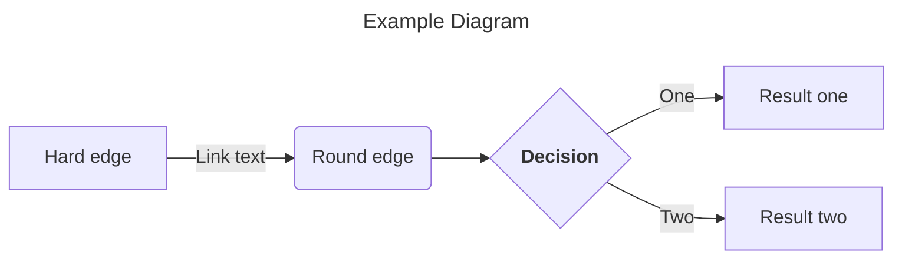

#### Part A: The 1,536 Pixel Artwork Canvas | Collective Artwork

1. Contribute at least one pixel to this [global artwork experiment](https://rcdonovan.com/1536)

**Planning to become a TA next time around!**

#### Part B: Cell-Free Protein Synthesis | Cell Free Reagents

1. Referencing the cell-free protein synthesis reaction composition (the middle box outlined in yellow on the image above, also listed below), provide a 1-2 sentence description of what each component’s role is in the cell-free reaction.

**E. coli Lysate**<br>
- **BL21 (DE3) Star Lysate (includes T7 RNA Polymerase)<br>
Provides the full transcription–translation machinery (ribosomes, tRNAs, initiation/elongation factors, chaperones) and, because it contains endogenous T7 RNA polymerase, it drives strong transcription from T7 promoters without needing an added polymerase.**

**Salts / Buffer**<br>
- **Potassium Glutamate<br>Maintains the intracellular‑like ionic strength and stabilizes ribosomes and translation factors, supporting efficient protein synthesis.**
- **HEPES‑KOH pH 7.5<br>Buffers the reaction at a physiologically relevant pH to maintain enzyme activity and prevent acidification during energy consumption.**
- **Magnesium Glutamate<br>Supplies Mg²⁺, which is essential for ribosome structure, tRNA charging, ATP‑dependent enzymes, and overall translation fidelity.**
- **Potassium Phosphate Monobasic & Dibasic<br>Together form a phosphate buffer system that stabilizes pH and provides phosphate needed for nucleotide and energy metabolism.**

**Energy / Nucleotide System**<br>
- **Ribose<br>Acts as a carbon backbone for nucleotide regeneration and supports metabolic pathways that recycle energy substrates.**
- **Glucose<br>Serves as the primary energy source for the lysate’s metabolic enzymes, enabling ATP regeneration and prolonging protein synthesis.**
- **AMP, CMP, GMP, UMP<br>Provide the nucleotide monophosphate precursors required for mRNA synthesis and nucleotide recycling during transcription.**
- **Guanine<br>Supports nucleotide biosynthesis and helps maintain balanced purine pools for efficient transcription.**

**Translation Mix (Amino Acids)**<br>
- **17 Amino Acid Mix<br>Supplies the majority of amino acids required for polypeptide elongation during translation.**
- **Tyrosine<br>Added separately because it is less stable in solution; ensures adequate levels for efficient incorporation into the growing peptide chain.**
- **Cysteine<br>Also added separately due to oxidation sensitivity; maintains sufficient reduced cysteine for proper translation and disulfide‑related chemistry.**

**Additives**<br>
- **Nicotinamide<br>Supports redox balance and metabolic cofactor regeneration (via NAD⁺/NADH cycling), which helps sustain energy metabolism in the lysate.**

**Backfill**<br>
- **Nuclease‑Free Water<br>Brings the reaction to its final volume while ensuring no contaminating nucleases degrade DNA or mRNA templates.**

2. Describe the main differences between the 1-hour optimized PEP-NTP master mix and the 20-hour NMP-Ribose-Glucose master mix shown in the Google Slide above. (2-3 sentences)

**The 1‑hour PEP‑NTP master mix is a <mark>high-energy, fast‑turnover system</mark> that supplies fully charged NTPs and uses PEP as an immediate ATP‑regenerating substrate, enabling rapid but short‑lived transcription–translation. In contrast, the 20‑hour NMP–Ribose–Glucose mix relies on nucleotide monophosphates plus ribose and glucose, forcing the lysate’s endogenous metabolism to rebuild NTPs and regenerate ATP more slowly but sustainably, which dramatically extends reaction lifetime. Overall, the PEP‑NTP system prioritizes speed and peak expression, while the NMP–Ribose–Glucose system prioritizes longevity and metabolic self‑regeneration.**

3. How can transcription occur if GMP is not included but Guanine is?

**T7 RNA polymerase does not use guanine directly—it requires GTP. In mixes where GMP is omitted but free guanine is supplied, the endogenous salvage‑pathway enzymes in the E. coli lysate (e.g., guanine phosphoribosyltransferase) convert guanine into GMP, which is then phosphorylated to GDP and GTP using the reaction’s energy system. This allows the system to rebuild the guanine nucleotide pool internally, enabling transcription even without added GMP.**

```mermaid
---
title: Guanine salvage pathway
---
graph LR;
    A[Guanine] --> B[Guanine Phosphoribosyltransferase GPRT]
    B --> C{<stron>GMP</strong>}
    C --> |ATP| D[GMP Kinase]
    C --> || E[GDP]
    E --> F[Nucleoside Diphosphate Kinase NDK]
    F --> G[GTP]
    G --> H[T7 RNA Polymerase uses GTP for transcription]
```

