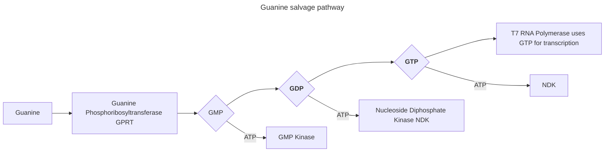

#### Part A: The 1,536 Pixel Artwork Canvas | Collective Artwork

1. Contribute at least one pixel to this [global artwork experiment](https://rcdonovan.com/1536)

**Planning to become a TA next time around!**

#### Part B: Cell-Free Protein Synthesis | Cell Free Reagents

1. Referencing the cell-free protein synthesis reaction composition (the middle box outlined in yellow on the image above, also listed below), provide a 1-2 sentence description of what each component’s role is in the cell-free reaction.

**E. coli Lysate** 
- **BL21 (DE3) Star Lysate (includes T7 RNA Polymerase) 
Provides the full transcription–translation machinery (ribosomes, tRNAs, initiation/elongation factors, chaperones) and, because it contains endogenous T7 RNA polymerase, it drives strong transcription from T7 promoters without needing an added polymerase.**

**Salts / Buffer** 
- **Potassium Glutamate Maintains the intracellular‑like ionic strength and stabilizes ribosomes and translation factors, supporting efficient protein synthesis.**
- **HEPES‑KOH pH 7.5 Buffers the reaction at a physiologically relevant pH to maintain enzyme activity and prevent acidification during energy consumption.**
- **Magnesium Glutamate Supplies Mg²⁺, which is essential for ribosome structure, tRNA charging, ATP‑dependent enzymes, and overall translation fidelity.**
- **Potassium Phosphate Monobasic & Dibasic Together form a phosphate buffer system that stabilizes pH and provides phosphate needed for nucleotide and energy metabolism.**

**Energy / Nucleotide System** 
- **Ribose Acts as a carbon backbone for nucleotide regeneration and supports metabolic pathways that recycle energy substrates.**
- **Glucose Serves as the primary energy source for the lysate’s metabolic enzymes, enabling ATP regeneration and prolonging protein synthesis.**
- **AMP, CMP, GMP, UMP Provide the nucleotide monophosphate precursors required for mRNA synthesis and nucleotide recycling during transcription.**
- **Guanine Supports nucleotide biosynthesis and helps maintain balanced purine pools for efficient transcription.**

**Translation Mix (Amino Acids)** 
- **17 Amino Acid Mix Supplies the majority of amino acids required for polypeptide elongation during translation.**
- **Tyrosine Added separately because it is less stable in solution; ensures adequate levels for efficient incorporation into the growing peptide chain.**
- **Cysteine Also added separately due to oxidation sensitivity; maintains sufficient reduced cysteine for proper translation and disulfide‑related chemistry.**

**Additives** 
- **Nicotinamide Supports redox balance and metabolic cofactor regeneration (via NAD⁺/NADH cycling), which helps sustain energy metabolism in the lysate.**

**Backfill** 
- **Nuclease‑Free Water Brings the reaction to its final volume while ensuring no contaminating nucleases degrade DNA or mRNA templates.**

2. Describe the main differences between the 1-hour optimized PEP-NTP master mix and the 20-hour NMP-Ribose-Glucose master mix shown in the Google Slide above. (2-3 sentences)

**The 1‑hour PEP‑NTP master mix is a <mark>high-energy, fast‑turnover system</mark> that supplies fully charged NTPs and uses PEP as an immediate ATP‑regenerating substrate, enabling rapid but short‑lived transcription–translation. In contrast, the 20‑hour NMP–Ribose–Glucose mix relies on nucleotide monophosphates plus ribose and glucose, forcing the lysate’s endogenous metabolism to rebuild NTPs and regenerate ATP more slowly but sustainably, which dramatically extends reaction lifetime. Overall, the PEP‑NTP system prioritizes speed and peak expression, while the NMP–Ribose–Glucose system prioritizes longevity and metabolic self‑regeneration.**

3. How can transcription occur if GMP is not included but Guanine is?

**T7 RNA polymerase does not use guanine directly—it requires GTP. In mixes where GMP is omitted but free guanine is supplied, the endogenous salvage‑pathway enzymes in the E. coli lysate (e.g., guanine phosphoribosyltransferase) convert guanine into GMP, which is then phosphorylated to GDP and GTP using the reaction’s energy system. This allows the system to rebuild the guanine nucleotide pool internally, enabling transcription even without added GMP.**

#### Part C: Planning the Global Experiment | Cell-Free Master Mix Design

1. Given the 6 fluorescent proteins we used for our collaborative painting, identify and explain at least one biophysical or functional property of each protein that affects expression or readout in cell-free systems. (Hint: options include maturation time, acid sensitivity, folding, oxygen dependence, etc) (1-2 sentences each)

- **sfGFP Superfolder green fluorescent protein has enhanced folding robustness and fast maturation, so it tends to reach a high fluorescent fraction even under crowded or mildly stressful cell-free conditions. Its relatively low pKa makes it fairly tolerant to modest acidification, keeping signal more stable over long incubations.**
- **mRFP1 mRFP1 is an early monomeric red fluorescent protein with relatively slow maturation and noticeable acid sensitivity, so low pH or limited oxygen will reduce the fraction of chromophores that become fluorescent. It is also dimmer and less photostable than newer reds, which can lower apparent expression/readout in long cell-free protein synthesis (CFPS) reactions.**
- **mKO2 mKO2 (orange) has slower maturation kinetics and can be somewhat sensitive to pH and temperature, so acidification or suboptimal incubation conditions will delay or reduce fluorescence. Its spectral overlap with other FPs can also complicate readout in multiplexed CFPS reactions.**
- **mTurquoise2 mTurquoise2 is very bright with a high quantum yield but has a relatively long maturation time, so fluorescence lags behind protein synthesis in CFPS. It can also be sensitive to photobleaching and pH, which affects long-term signal stability.**
- **mScarlet_I mScarlet_I is an extremely bright, fast-maturing monomeric red FP, so it reaches high fluorescence quickly and is excellent for dynamic measurements. However, like many red FPs, it depends on oxygen for chromophore formation and can be partially quenched at lower pH, which matters in long, high‑glucose CFPS reactions.**
- **Electra2 Electra2 (far-red/red derivative) typically has slower maturation and lower apparent brightness than the best greens/reds, so a significant fraction of protein may remain non-fluorescent during shorter incubations. Its far‑red chromophore is also more sensitive to oxygen availability and pH, making long-term CFPS readout more vulnerable to metabolic acidification and oxygen depletion.**

2. Create a hypothesis for how adjusting one or more reagents in the cell-free mastermix could improve a specific biophysical or functional property you identified above, in order to maximize fluorescence over a 36-hour incubation. Clearly state the protein, the reagent(s), and the expected effect.
**mRFP1 is relatively slow-maturing and acid-sensitive, I hypothesize that increasing buffer capacity (higher HEPES and/or phosphate) and slightly reducing glucose concentration in the mastermix will limit pH drop over 36 hours, thereby reducing acid quenching and allowing more mRFP1 molecules to fully mature. As a result, the fraction of fluorescent mRFP1 and total red fluorescence at 36 hours should increase, even if total protein synthesis is unchanged.**