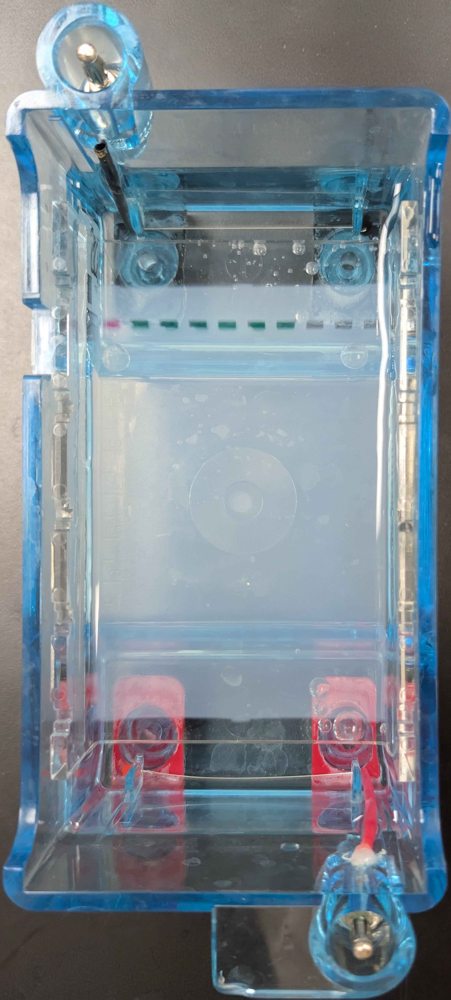

## Gel Art - Restriction Digests and Gel Electrophoresis
Protocol | Part 0: Designing your Gel Art 
Protocol | Part 1a: Preparing a 1% agarose electrophoresis gel 
gel protocals
 
<embed src="gelart_protocal1.pdf" type="application/pdf">
Protocol | Part 1b: Restriction Digest 
Protocol | Part 2: Gel Run 
Protocol | Part 3: Imaging Your Results with a Transilluminator 
| pre                           | post                            |
| ----------------------------------- | ----------------------------------- |
|||