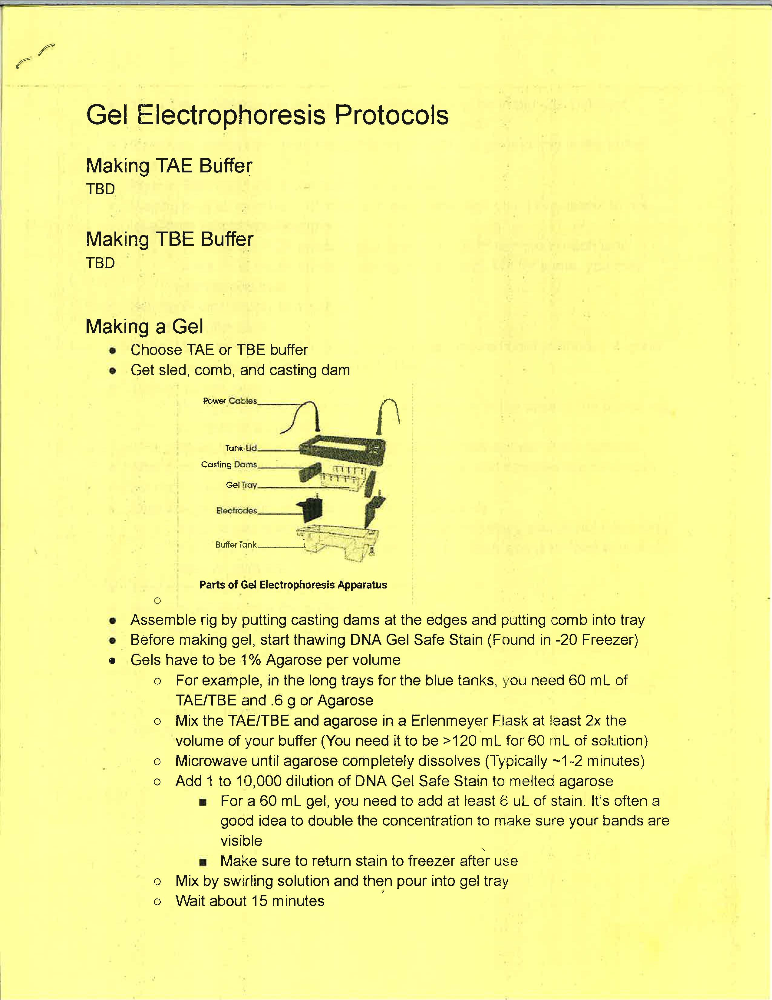
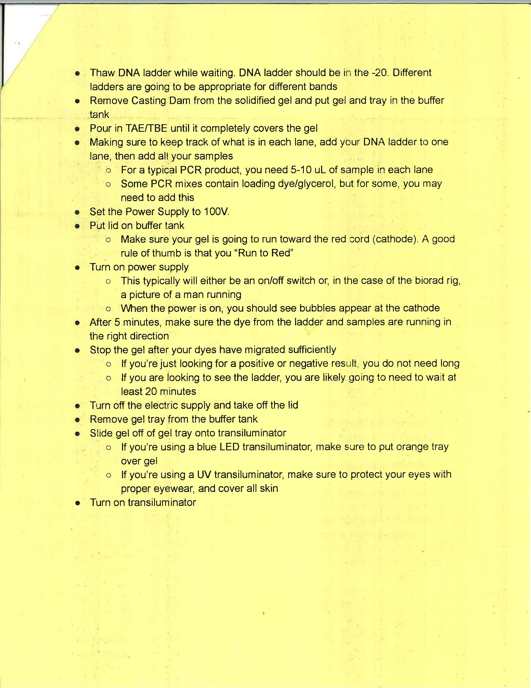
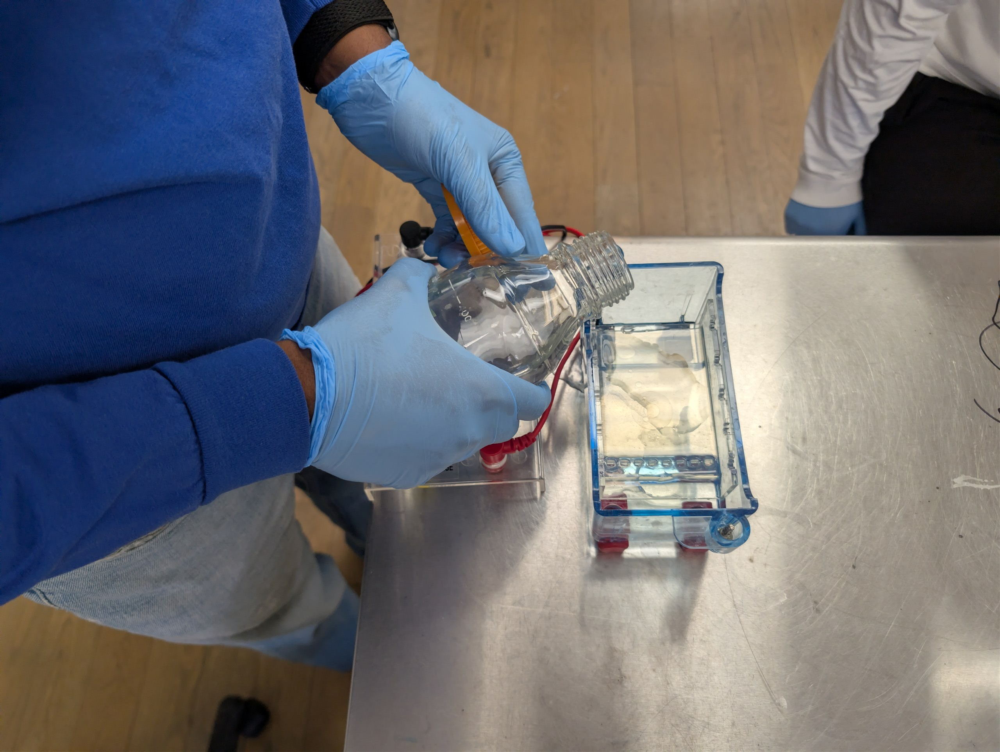

## Gel Art - Restriction Digests and Gel Electrophoresis
Protocol | Part 0: Designing your Gel Art

Protocol | Part 1a: Preparing a 1% agarose electrophoresis gel

gel protocals 
 

Protocol | Part 1b: Restriction Digest

Protocol | Part 2: Gel Run

Protocol | Part 3: Imaging Your Results with a Transilluminator

| pre| post|
| -| - |
|||