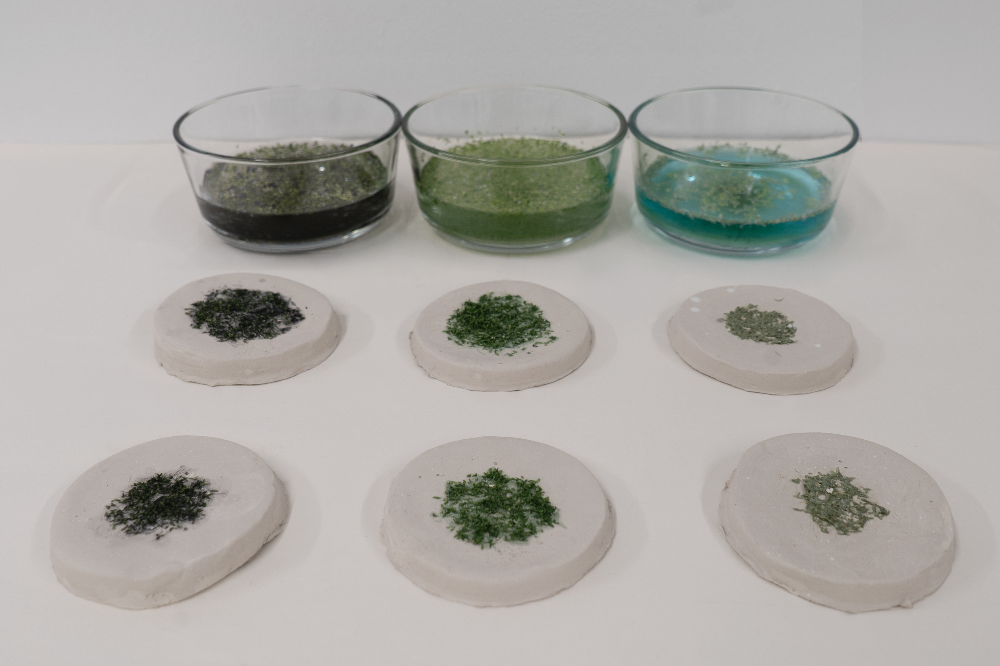

| pre-fire                            | post-fire                            |
| ----------------------------------- | ----------------------------------- |
|||

## Section 1: Abstract
Environmental pollution caused by anthropogenic activity, particularly heavy metal contamination, has created an increasing need for sustainable and cost-effective methods of environmental monitoring and remediation. *Lemna minEr*, a project supervised by Dr. Andrew Scarpelli, explores the use of phytoremediation to address water scarcity and contamination caused by industrial metal pollution. The project focuses on engineering a transgenic *Lemna minor* (duckweed) system with enhanced copper uptake, tolerance, and accumulation capabilities.

The overall objective of this project is to improve copper phytomining and remediation efficiency in *Lemna minor* through transgenic expression of metal transport and detoxification proteins. The project tests the hypothesis that expression of the copper transporter AtCOPT1 from *Arabidopsis thaliana* will enhance copper uptake, while co-expression of phytochelatin synthase (PCS) will improve intracellular detoxification and sequestration of copper ions. A red fluorescent protein (RFP) reporter is additionally incorporated to enable visual confirmation of successful transformation and gene expression.

To achieve this objective, the project first aims to design and assemble a multi-cassette plant expression plasmid containing COPT1, PCS, and RFP expression modules. The plasmid is constructed using an *E. coli* backbone and initially propagated through heat-shock transformation in *E. coli*. The amplified plasmid is then transferred into *Agrobacterium tumefaciens* through electroporation. Finally, Agrobacterium-mediated transformation is performed by co-cultivating the bacteria with *Lemna minor* fronds, enabling DNA transfer into plant cells through the bacterium’s natural infection pathway.

Following successful transformation, the project will evaluate whether transgenic *Lemna minor* demonstrates enhanced copper uptake and improved metal tolerance compared to wild-type plants. In the long term, this work explores the scalability of engineered duckweed as a sustainable phytoremediation platform for environmental cleanup and water treatment applications.

## Section 2: Project Aims
### Aim 1: Experimental Aim
The first aim of my final project is to design and assemble a multi-cassette plant expression plasmid capable of expressing AtCOPT1, phytochelatin synthase (PCS), and a red fluorescent protein (RFP) reporter in *Lemna minor* by utilizing molecular cloning, bacterial transformation, and Agrobacterium-mediated plant transformation protocols.
### Aim 2: Development Aim
The second aim of this project is to evaluate whether transgenic *Lemna minor* overexpressing COPT1 and PCS demonstrates improved copper uptake, accumulation, and detoxification compared to wild-type plants through comparative copper remediation assays and tissue stress analysis.
### Aim 3: Visionary Aim
The third aim of this project is to develop a scalable phytoremediation platform using engineered *Lemna minor* for sustainable environmental monitoring, heavy metal cleanup, and water treatment applications in polluted aquatic environments.

## Section 3: Background
Dr. Andrew Scarpelli referred me to several papers that explored the use of synthetic biology as a way to address environmental issues through transgenic expression systems. These studies provided both conceptual and technical foundations for this project by demonstrating that plants can be genetically engineered for specialized biological functions beyond their native capabilities.

In “Programmable Ligand Detection System in Plants through a Synthetic Signal Transduction Pathway,” (Antunes et al., 2011)[^1] demonstrated that plants can be genetically engineered with synthetic signaling pathways capable of detecting environmental ligands with high specificity. The study utilized computationally-redesigned periplasmic binding proteins (PBPs) coupled with transmembrane histidine kinase (HK) signaling systems to create programmable biosensing capabilities in plants. This work demonstrated the successful design of synthetic biological pathways that can function within plant systems while maintaining environmental responsiveness. The study is significant because it showed that plants can be engineered beyond their native biological functions to perform targeted sensing and response behaviors.
[^1]: Antunes, Mauricio S et al. “Programmable ligand detection system in plants through a synthetic signal transduction pathway.” PloS one vol. 6,1 e16292. 25 Jan. 2011, doi:10.1371/journal.pone.0016292.

Additional research has reported successful transgenic engineering experiments specifically in duckweed species, providing valuable technical references for genetically engineering *Lemna* plants. In “Engineering triacylglycerol accumulation in duckweed (*Lemna japonica*),” (Liang et al., 2023)[^2] successfully enhanced triacylglycerol (TAG) accumulation through Agrobacterium-mediated multi-cassette transformation. The study demonstrated stable transgenic expression in duckweed callus cultures and highlighted the potential of duckweed as an engineered biological platform for biofuel production through increased lipid accumulation in vegetative tissues. Other studies, including (Boehm et al., 2001[^3]; Wang et al., 2021[^4]), further established reproducible Agrobacterium-mediated transformation systems across multiple duckweed species. Together, these studies demonstrated both the feasibility of transgenic duckweed engineering and the compatible methodological approach via agrobacterium-mediated transformation.
[^2]: Liang, Yuanxue et al. “Engineering triacylglycerol accumulation in duckweed (Lemna japonica).” Plant biotechnology journal vol. 21,2 (2023): 317-330. doi:10.1111/pbi.13943
[^3]: Boehm, R. , Kruse, C. , Voeste, D. , Barth, S. and Schnabl, H. (2001) A transient transformation system for duckweed (Wolffia columbiana) using Agrobacterium‐mediated gene transfer. J. Appl. Bot. 75, 107–111. [Google Scholar]
[^4]: Wang, K.‐T. , Hong, M.‐C. , Wu, Y.‐S. and Wu, T.‐M. (2021) Agrobacterium‐mediated genetic transformation of taiwanese isolates of Lemna aequinoctialis . Plants, 10, 1576. [DOI] [PMC free article] [PubMed] [Google Scholar]

Seeing the successful applications of transgenic expression in synthetic signaling systems and metabolic engineering, Dr. Andrew Scarpelli proposed extending similar synthetic biology approaches toward environmental phytoremediation. While previous studies primarily focused on biosensing applications or biofuel production, we sought to adapt these methods to other environmental challenges by leveraging engineered duckweed for enhanced heavy metal uptake and detoxification. We are excited about this project because Lemna is a genus of aquatic plants with species found across five continents, and there is already a substantial body of research supporting its use in genetic and environmental applications. This makes the system highly feasible and scalable across diverse research contexts, especially when considering bioinvasion risks and adapting regional implementation strategies with appropriate species lines.

This project addresses pressing global issues including water scarcity, industrial heavy metal pollution, and the need for more sustainable process engineering approaches. It recognizes the importance of existing industrial activity while emphasizing the need to develop environmentally sustainable solutions that mitigate long-term ecological damage. As demonstrated in prior studies, efforts to enhance plant-based systems for applications such as biofuel production were originally motivated by challenges like food shortages and increasing global population demand. In a similar way, Lemna minEr addresses water as a finite and vulnerable resource, focusing instead on improving water quality and reducing contamination through synthetic biology and process engineering approaches.

Describe the ethical implications associated with your project and identify relevant ethical principles (e.g., non-maleficence, beneficence, justice, or responsibility). (Minimum 2 paragraphs.)
### SECTION 4: EXPERIMENTAL DESIGN, TECHNIQUES, TOOLS, AND TECHNOLOGY
Create a detailed experimental plan for your final project. Include a timeline for each part of your experimental plan (i.e., how long you would expect each step in your final project to take). (min. 15 lines/sentences—a numbered list is acceptable)

### SECTION 5: Results & Quantitative Expectations
| pre-fire                            | post-fire                            |
| ----------------------------------- | ----------------------------------- |
|||
What aspect of your final project did you choose to validate? (min. 2 sentences)

Write down a detailed protocol of how you validated this aspect of your final project. (Numbered list or paragraph is fine)

What synthetic biology techniques did you utilize in validating this aspect of your final project? You can refer to the list of techniques in question 8. (min. 4 sentences)

You must present data as part of your final project and include some analysis of that data. The data may be collected experimentally in the lab or generated as simulated data (e.g., using the Asimov Kernel or another simulation method). (min. 2 sentences)

Did you encounter any unexpected challenge(s) when performing your validation? If so, describe the challenge(s) and strategies to overcome it. If not, discuss potential problems, difficulties, limitations, and/or alternative strategies to overcome challenges in your final project. (min. 4 sentences). 
